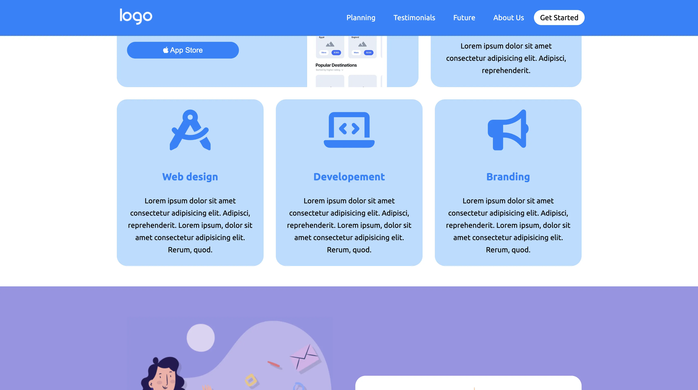

# 🧩 Responsive Layout – Replica HTML & CSS

> [!NOTE]
>
> Progetto a scopo di esercitazione

Un progetto **HTML e CSS puro** per la creazione di un **layout responsive multi-sezione**, ideato per esercitare la costruzione di griglie flessibili e la gestione del design adattivo senza l’uso di framework esterni.

---

## 🎯 Obiettivo del progetto

L’obiettivo principale è **imparare a strutturare un layout scalabile e adattivo**, curando la disposizione visiva e la coerenza tra i vari breakpoint.

Focus didattici:

- Strutturare la pagina con **HTML semantico**
- Gestire layout complessi tramite **Flexbox e CSS Grid**
- Utilizzare **media query** per la piena adattabilità
- Creare componenti visivi modulari e riutilizzabili
- Mantenere una gerarchia visiva coerente e leggibile

---

---

## 💡 Tecnologie utilizzate

- **HTML5** → struttura semantica e pulita
- **CSS3** → layout responsive e variabili personalizzate
- **Flexbox / Grid** → gestione di sezioni e colonne
- **Google Fonts** → tipografia moderna e leggibile

---

## 📱 Design responsive

✅ Desktop  
✅ Tablet  
✅ Mobile

L’interfaccia si adatta perfettamente a qualsiasi dispositivo, garantendo **leggibilità, equilibrio visivo e ottima usabilità** grazie all’uso di media query ottimizzate.

---

byHYONS™
